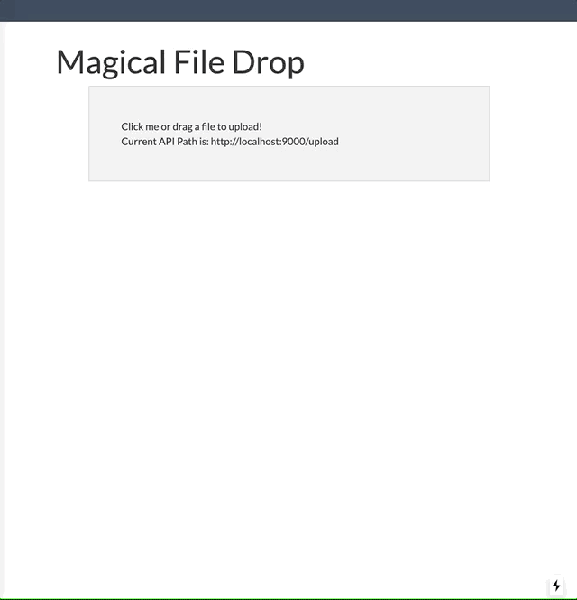

# What....is this?

I needed to understand the flow required for a backend to pre-sign an AWS post so a front-end client could upload large files directly to AWS.

I had written a little throwaway demonstrator, but I had been looking for an excuse to build something in ReactJS/next.js and a stripped down Symfony 4 API backend.

So this demo serves a couple of purposes:
  * Prove that ReactJS/next.js can play nicely with a PHP backend
  * Demonstrate that a react client could upload a file to S3
  * Keep the actual S3 credentials locked up in a PHP Backend

"Hey!  Why didn't you...."
  * Use Node for the backend?
  * Break out more components in your next.js?
  * Perform multi-part uploads
  * Enable Transfer Acceleration
  * ... 

Great questions, but this was just a quick weekend project. I had to stop eventually.

## Demo in Action


# Running this Demo project

## AWS Setup

Login as your root user

IAM -> Create a new Account, API only.
Be sure to grab the API Access and Secret.

Grant it access to your S3 bucket/buckets however you see fit.

Grab the aws-cli (or better, try aws-shell).  Be sure to configure with your access key and secret.

```aws
configure
s3api create-bucket demo-bucket-2019
```

## Demo Setup

Assumes you have php >= 7.1, npm and composer installed locally.

Install the dependencies

```
composer install
npm install
```

Add your AWS API account key, secret and bucket nameto a file called .env.local
```
AWS_KEY=ABC123ABC123ABC123AB
AWS_SECRET=SecretSecretSecretSecretSecretSecretSecr
APP_S3_BUCKET_DEMO=your-demo-bucket-name
```

start the next.js/npm instance
```
npm run dev
```

Then in another console or tab, start the php backend
```
composer run-script dev --timeout=0
```
You should not be able to get to the following URLs:

* backend (PHP): http://localhost:9000/
* frontend (NextJS): http://localhost:3000/

# Doing this yourself

Want to learn some of this on your own?  Go for it!  These are some REALLY rough notes with pleanty of holes.  But give it a shot!

## Symfony 4/Flex Setup
```bash
composer create-project symfony/skeleton s3-upload-demo
cd s3-upload-demo
git init
```
Add some basic packages.  The skeleton is BARE BONES so you need to add logging, caching...basically everything.  We just need route annotations and the aws sdk for nwo.

```bash
composer require annotations
composer require aws/aws-sdk-php-symfony
```

Add annotation support for controllers by adding the following

config/routes.yaml
```yaml
controllers:
    resource: '../src/Controller/'
    type:     annotation
```

update the .env file with your access key and secret

start the dev webserver (assuming local PHP and not using docker, etc)
```bash
composer require --dev symfony/web-server-bundle
```

You can make it easy to start this dev server by adding a line to the scripts section of your composer.json file
```json
{
    "scripts": {
        "dev": "php bin/console server:run 127.0.0.1:9000"
    }
}
```

# npm/next.js setup

```
npm init -y
npm install --save react react-dom next
npm install --save axios react-dropzone
npm install dotenv
```

update your package.json file to make sure you have at least some basic scripts:

```json
{
  "scripts": {
    "test": "echo \"Error: no test specified\" && exit 1",
    "dev": "next",
    "build": "next build",
    "start": "next start"
  }
}
```

Let's add a link back to your backend host our next app so

```
module.exports = {
    serverRuntimeConfig: { // Will only be     available on the server side
    },
    publicRuntimeConfig: { // Will be available on both server and client
      apiPath: process.env.API_PATH || "http://localhost:9000"
    }
  }
```

And with that, you will now be able to access `process.env.API_HOST` from inside your nextJS pages!

From there, we added our next.js pages and components and our symfony routes and services.  Enjoy!
